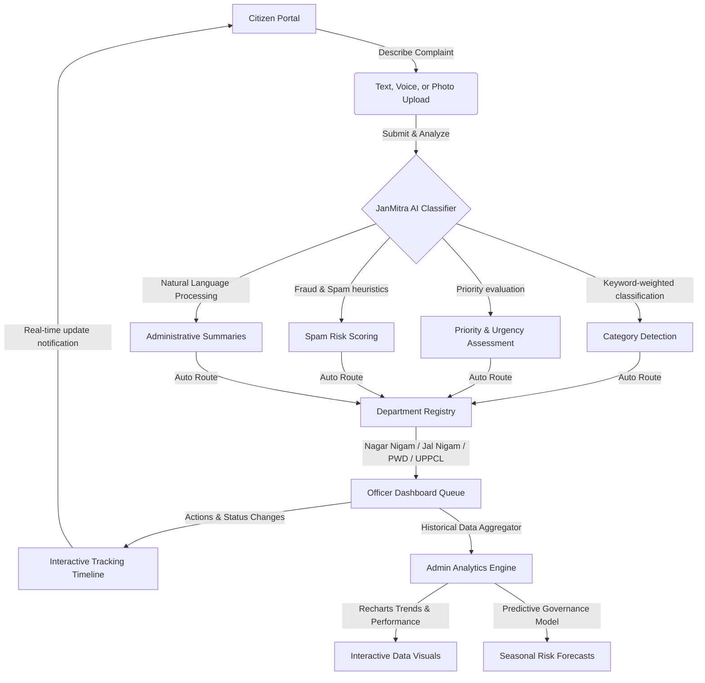

# 🏛️ JanMitra AI — Next-Gen Smart Citizen Grievance & Predictive Governance Platform

> **JanMitra AI** is a state-of-the-art citizen grievance redressal and predictive analytics platform engineered for modern municipal administrations. It transforms public administration by leveraging artificial intelligence to automatically understand, prioritize, summarize, and route citizen complaints with unmatched transparency, accountability, and speed.

---

## 🌟 Key Features

### 1. 🎙️ Citizen Engagement Portal
*   **Multi-Channel Inputs:** Citizens can describe their issues using text or mock voice recordings that dynamically transcribe into detailed complaint descriptions.
*   **Real-time AI Vision Scanning:** Citizens can upload photos of civic issues (e.g., garbage dumps or broken pipes) which are automatically scanned by the AI vision module.
*   **Live AI Classification Pipeline:** An interactive processing module visually tracks the complaint through five automated stages:
    1. *Parsing and analyzing complaint text...*
    2. *Detecting complaint category...*
    3. *Assessing priority, urgency, and severity...*
    4. *Routing to the appropriate municipal department...*
    5. *Generating administrative officer summary...*
*   **GIS & Map-based Tracking:** Automatic real-time location detection using the Geolocation API, mapped with reverse geocoding descriptions (e.g., Gomti Nagar, Lucknow).
*   **High-Fidelity Tracking Timeline:** Transparent tracking from `Submitted ➔ AI Analyzing ➔ Department Assigned ➔ Officer Reviewing ➔ In Progress ➔ Resolved`.

### 2. 👮 Officer Command Console
*   **Automated Department Queues:** Personalized dashboards for officers to manage incoming requests, complete with search, filter, and sorting utilities.
*   **AI Recommendations Engine:** Smart, high-confidence actionable insights powered by AI heuristics:
    *   *Urgent Deployments* triggered by localized spike patterns.
    *   *Auto-Escalation* systems to prevent response delays.
    *   *Duplicate Merging* suggestions for overlapping complaints from identical blocks.
*   **Operational Metrics:** Real-time monitoring of department resolution times, AI routing accuracy, and citizen satisfaction ratings.

### 3. 📊 Admin Console & Predictive Governance
*   **Interactive Analytics Charts:** Rich data visualizations powered by `Recharts` featuring area charts (grievance trends), pie charts (category distributions), and line charts (resolution times).
*   **Predictive Governance Engine:** Dynamic forecasting of potential municipal issues based on seasonal patterns and historical data (e.g., predicting pre-monsoon drainage bottlenecks or high-summer electricity grid strain).
*   **Inter-Department Efficiency Matrix:** visual performance benchmarks comparing department resolution speeds and pending active workloads.

---

## 🔄 System Flow & Architecture



---

## 📂 Project Directory Structure

```bash
janmitra-ai/
├── src/
│   ├── app/                      # Next.js 16 App Router pages
│   │   ├── admin/                # Admin analytics page
│   │   ├── citizen/              # Citizen portal dashboard
│   │   ├── officer/              # Officer ticket queues
│   │   ├── layout.tsx            # Global layout configuration
│   │   └── page.tsx              # Portal landing page
│   ├── components/
│   │   ├── admin/                # Recharts analytics charts
│   │   ├── citizen/              # Complaint submission form & timelines
│   │   ├── landing/              # Landing page sections (Hero, CTA, Features)
│   │   ├── shared/               # Global components (Navbar, Footer, ThemeToggle)
│   │   └── ui/                   # Shared UI primitives (Buttons, Badges, Tabs)
│   ├── data/
│   │   ├── complaints.ts         # Mock complaints & statistics
│   │   └── departments.ts        # Municipal department registry & routing logic
│   ├── lib/
│   │   ├── ai.ts                 # AI Classification & Urgency Engine
│   │   └── utils.ts              # Styling & styling utilities
│   └── types/
│       └── index.ts              # TypeScript interface definitions
├── public/                       # Static public assets
├── package.json                  # Dependencies configuration
└── tailwind.config.ts            # Tailwind CSS configuration
```

---

## 💼 Department & Category Routing Registry

JanMitra AI maps public grievances to the corresponding municipal departments automatically based on a double-weighted keyword vocabulary:

| Complaint Category | Default Assigned Department | Avg. Resolution | Sample Keywords |
| :--- | :--- | :--- | :--- |
| **Garbage / Sanitation** | Lucknow Nagar Nigam | 3 Days | garbage, trash, cleaning, dirt, dump, sweep |
| **Water Supply** | Lucknow Jal Nigam | 5 Days | water, pipeline, sewage, sewer, leakage, burst |
| **Road Damage** | Public Works Department (PWD) | 7 Days | road, pothole, broken, crack, asphalt, tar |
| **Electricity** | Power Department (UPPCL) | 2 Days | power, wire, transformer, voltage, outage, electricity |
| **Street Light** | Lucknow Municipal Corporation | 4 Days | street light, pole, night, dark, lamp, blacked out |
| **Illegal Construction** | Municipal Authority | 10 Days | illegal, building, unauthorized, encroachment, violation |
| **Encroachment** | Municipal Authority | 10 Days | encroachment, grab, footpath, sidewalk, illegal occupation |
| **Corruption** | Anti-Corruption Bureau | 14 Days | bribe, corruption, scam, fraud, graft, bribery |
| **Public Health** | Health Department | 3 Days | health, hospital, doctor, clinic, disease, epidemic, medical |

---

## 💻 Tech Stack & Tooling

*   **Framework:** [Next.js 16](https://nextjs.org/) (App Router)
*   **Runtime Library:** [React 19](https://react.dev/)
*   **Styling & Animations:** [Tailwind CSS v4](https://tailwindcss.com/) & [Framer Motion](https://www.framer.com/motion/)
*   **Mapping:** [React Leaflet](https://react-leaflet.js.org/) & [Leaflet](https://leafletjs.com/) for GIS tracking
*   **Visualizations:** [Recharts](https://recharts.org/) for beautiful modern administrative charts
*   **Icons:** [Lucide React](https://lucide.dev/) for premium SVG iconography

---

## 🚀 Getting Started

Follow these steps to run the application locally in development mode:

### 1. Clone the repository
```bash
git clone https://github.com/theabhishek4u/JanMitra-AI.git
cd janmitra-ai
```

### 2. Install dependencies
```bash
npm install
```

### 3. Run the development server
```bash
npm run dev
```

Open [[http://localhost:3000](https://jan-mitra-ai-opal.vercel.app/)](https://jan-mitra-ai-opal.vercel.app) with your browser to experience the landing page, and visit the distinct routes:
*   **Landing Page:** `/`
*   **Citizen Dashboard:** `/citizen`
*   **Officer Portal:** `/officer`
*   **Admin Console:** `/admin`

---

## ⚙️ Configuration & Customization

### Modifying Keywords or Adding Departments
To extend the routing rules or add new departments, modify the registry inside [src/data/departments.ts](file:///c:/My%20Project/Agentic%20Premier%20League%20(APL)/janmitra-ai/src/data/departments.ts). The AI engine automatically updates its routing heuristics:

```typescript
export const departments: Department[] = [
  // Add new department here...
];

export const categories: ComplaintCategory[] = [
  // Add new category with sample keywords...
];
```

### Customizing AI Classification Heuristics
The core keyword-weighted routing engine is located in [src/lib/ai.ts](file:///c:/My%20Project/Agentic%20Premier%20League%20(APL)/janmitra-ai/src/lib/ai.ts). You can tweak keyword scores, priorities, and fraud estimation percentages directly.
