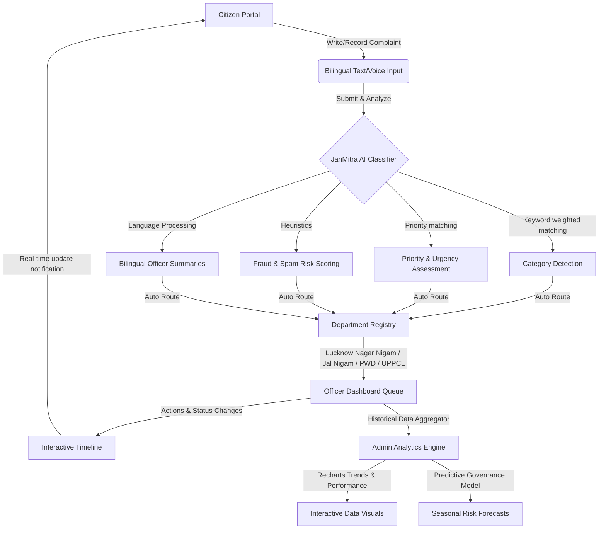

# 🏛️ JanMitra AI — Smart Citizen Grievance & Predictive Governance Platform

> **JanMitra AI (जनमित्र AI)** is a state-of-the-art bilingual citizen grievance redressal and predictive analytics platform built for municipal administrations in India (specifically styled for Lucknow, Uttar Pradesh). It transforms public administration by leveraging artificial intelligence to automatically understand, prioritize, summarize, and route citizen complaints in English, Hindi, and Urdu.

---

## 🌟 Key Features

### 1. 🎙️ Citizen Portal (नागरिक पोर्टल)
*   **Bilingual Text & Voice Inputs:** Citizens can describe their issues in English, Hindi, or Urdu. Supports mock voice recordings that automatically transcribe into native script.
*   **Real-time AI Analysis Steps:** Features an interactive processing pipeline that visually walks the citizen through AI steps:
    1. *Understanding complaint text... (शिकायत पाठ समझ रहा है)*
    2. *Detecting complaint category... (शिकायत श्रेणी पहचान रहा है)*
    3. *Assessing priority & urgency... (प्राथमिकता और तत्कालता का आकलन)*
    4. *Routing to department... (विभाग को रूट कर रहा है)*
    5. *Generating officer summary... (अधिकारी सारांश तैयार कर रहा है)*
*   **GIS & Map-based Tracking:** Real-time location auto-detection using Geolocation API, reverse geocoding representation (e.g., Gomti Nagar, Lucknow), and tracking timelines.
*   **Transparent Status Timeline:** Citizen-friendly tracking from `Submitted ➔ AI Analyzing ➔ Department Assigned ➔ Officer Reviewing ➔ In Progress ➔ Resolved`.

### 2. 👮 Officer Dashboard (अधिकारी डैशबोर्ड)
*   **Automated Department Queues:** Personalized dashboards for officers (e.g., Municipal Commissioner Rajesh Kumar) to manage incoming requests.
*   **AI Recommendations Panel:** High-confidence recommendations powered by AI heuristics:
    *   *Urgency deployments* based on complaints frequency in specific sectors.
    *   *Auto-escalation* triggers when actions are delayed.
    *   *Duplicate merging suggestions* for complaints coming from identical blocks.
*   **Performance Metrics:** Live tracking of AI classification accuracy, average department resolution times, and citizen satisfaction ratings.

### 3. 📊 Admin Analytics & Predictive Governance (प्रशासनिक विश्लेषण)
*   **Interactive Analytics:** Powered by `Recharts`, providing rich area, pie, and line charts tracing complaint trends, category distribution, and resolution speed improvements.
*   **Predictive Governance Engine:** Forecasting potential municipal issues based on seasonal patterns and historical data (e.g., predicting drainage overflows in Rajajipuram during pre-monsoon, or electricity grid strains in Alambagh).
*   **Inter-Department Efficiency Matrix:** Visual benchmarks comparing department resolution rates and active workloads.

---

## 🔄 System Flow & Architecture



---

## 📂 Project Directory Structure

```bash
janmitra-ai/
├── src/
│   ├── app/                      # Next.js 16 App Router pages
│   │   ├── admin/                # Admin analytics page
│   │   ├── citizen/              # Citizen portal dashboard
│   │   ├── officer/              # Officer ticket queues
│   │   ├── layout.tsx            # Global layout configuration
│   │   └── page.tsx              # Portal landing page
│   ├── components/
│   │   ├── admin/                # Recharts analytics charts
│   │   ├── citizen/              # Complaint submission form & timelines
│   │   ├── landing/              # Landing page sections (Hero, CTA, Features)
│   │   ├── shared/               # Global components (Navbar, Footer, ThemeToggle)
│   │   └── ui/                   # Shared UI primitives (Buttons, Badges, Tabs)
│   ├── data/
│   │   ├── complaints.ts         # Mock complaints & statistics
│   │   └── departments.ts        # Municipal department registry & routing logic
│   ├── lib/
│   │   ├── ai.ts                 # AI Classification & Urgency Engine
│   │   └── utils.ts              # Styling & styling utilities
│   └── types/
│       └── index.ts              # TypeScript interface definitions
├── public/                       # Static public assets
├── package.json                  # Dependencies configuration
└── tailwind.config.ts            # Tailwind CSS configuration
```

---

## 💼 Department & Category Routing Registry

JanMitra AI maps public grievances to the corresponding municipal departments automatically based on a double-weighted bilingual (English & Hindi) keyword vocabulary:

| Complaint Category | विभाग (Hindi) | Default Assigned Department | Avg. Resolution | Sample Keywords (EN/HI) |
| :--- | :--- | :--- | :--- | :--- |
| **Garbage / Sanitation** | कूड़ा / स्वच्छता | Lucknow Nagar Nigam | 3 Days | garbage, trash, cleaning, dirt, कूड़ा, गंदगी, सफाई |
| **Water Supply** | जल आपूर्ति | Jal Nigam | 5 Days | water, pipeline, sewage, sewer, leakage, पानी, सीवर, लीकेज |
| **Road Damage** | सड़क क्षति | Public Works Department (PWD) | 7 Days | road, pothole, broken, crack, सड़क, गड्ढा, टूटी सड़क |
| **Electricity** | बिजली | Power Department (UPPCL) | 2 Days | power, wire, transformer, voltage, बिजली, ट्रांसफार्मर, तार |
| **Street Light** | स्ट्रीट लाइट | Lucknow Municipal Corporation | 4 Days | street light, pole, night, dark, स्ट्रीट लाइट, खंभा, अंधेरा |
| **Illegal Construction** | अवैध निर्माण | Municipal Authority | 10 Days | illegal, building, unauthorized, अवैध, निर्माण, कब्जा |
| **Encroachment** | अतिक्रमण | Municipal Authority | 10 Days | encroachment, grab, footpath, अतिक्रमण, कब्जा, फुटपाथ |
| **Corruption** | भ्रष्टाचार | Anti-Corruption Bureau | 14 Days | bribe, corruption, scam, fraud, भ्रष्टाचार, रिश्वत, धोखाधड़ी |
| **Public Health** | जन स्वास्थ्य | Health Department | 3 Days | health, hospital, doctor, clinic, disease, स्वास्थ्य, अस्पताल, बीमारी |

---

## 💻 Tech Stack & Tooling

*   **Framework:** [Next.js 16](https://nextjs.org/) (App Router)
*   **Runtime Library:** [React 19](https://react.dev/)
*   **Styling & Animations:** [Tailwind CSS v4](https://tailwindcss.com/) & [Framer Motion](https://www.framer.com/motion/)
*   **Mapping:** [React Leaflet](https://react-leaflet.js.org/) & [Leaflet](https://leafletjs.com/) for GIS tracking
*   **Visualizations:** [Recharts](https://recharts.org/) for beautiful modern administrative charts
*   **Icons:** [Lucide React](https://lucide.dev/) for premium SVG iconography

---

## 🚀 Getting Started

Follow these steps to run the application locally in development mode:

### 1. Clone the repository
```bash
git clone https://github.com/your-username/janmitra-ai.git
cd janmitra-ai
```

### 2. Install dependencies
```bash
npm install
```

### 3. Run the development server
```bash
npm run dev
```

Open [http://localhost:3000](http://localhost:3000) with your browser to experience the landing page, and visit the distinct routes:
*   **Landing Page:** `/`
*   **Citizen Dashboard:** `/citizen`
*   **Officer Portal:** `/officer`
*   **Admin Console:** `/admin`

---

## ⚙️ Configuration & Customization

### Modifying Keywords or Adding Departments
To extend the routing rules, add new departments or category entries inside [src/data/departments.ts](file:///c:/My%20Project/Agentic%20Premier%20League%20(APL)/janmitra-ai/src/data/departments.ts). The AI engine automatically updates its routing heuristics:

```typescript
export const departments: Department[] = [
  // Add new department here...
];

export const categories: ComplaintCategory[] = [
  // Add new category with English and Hindi keywords...
];
```

### Customizing AI Classification Heuristics
The core keyword-weighted routing engine is located in [src/lib/ai.ts](file:///c:/My%20Project/Agentic%20Premier%20League%20(APL)/janmitra-ai/src/lib/ai.ts). You can tweak keyword scores, priorities, and fraud estimation percentages directly.
