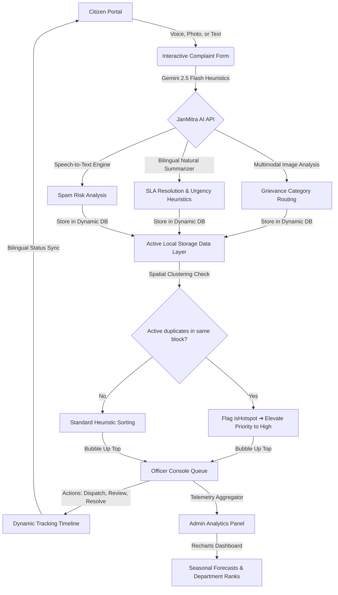

# 🏛️ JanMitra AI — Next-Gen Smart Citizen Grievance & Predictive Governance Platform

[](https://nextjs.org/)
[](https://react.dev/)
[](https://tailwindcss.com/)
[](https://deepmind.google/technologies/gemini/)
[](https://leafletjs.com/)

> **JanMitra AI** (जनमित्र) is a premium, state-of-the-art citizen grievance redressal and predictive analytics platform engineered for modern municipal administrations in Uttar Pradesh. By combining Google Gemini-powered multimodal AI analysis, native speech-to-text voice transcriptions, dynamic spatial hotspot clustering, and role-based authentication gates, JanMitra AI eliminates wrong department assignments, administrative delays, and lack of accountability. It transforms standard public administration into a premium, secure, dark-themed SaaS-level governance HUD.

---

## 🌟 Modern Core Modules

### 1. 🎙️ Citizen Engagement Portal
*   **Multimodal AI Vision Scanning:** Citizens can upload photos of civic issues (e.g., garbage piles, burst pipes, broken streetlights) which are processed using the Gemini Vision model.
*   **Speech-to-Text Audio Transcriptions:** Speak in Hindi, Urdu, Hinglish, or English. Dynamic custom speech-to-text transcribes conversational Hinglish and local slang into detailed, high-accuracy grievances.
*   **Live Interactive Diagnostic HUD:** Watch the AI analyze your complaint in real time through an animated HUD tracking:
    1. *Parsing and analyzing complaint text...*
    2. *Detecting complaint category...*
    3. *Assessing priority, urgency, and severity...*
    4. *Routing to the appropriate municipal department...*
    5. *Generating administrative officer summary...*
*   **GIS Geolocation Pinning:** Real-time citizen location tracking via the browser Geolocation API with interactive OpenStreetMap integration, reverse-geocoding coordinates directly to localized zones (e.g. *Gomti Nagar, Lucknow*).
*   **Holographic Tracking Timeline:** Complete transparency from `Submitted ➔ AI Analyzing ➔ Department Assigned ➔ Officer Reviewing ➔ Action In Progress ➔ Resolved`.
*   **Premium Color-Coded Priority Cards:** Redesigned the priority selector with card-styled elements (Auto, Normal, Urgent, Critical) containing smooth micro-animations and glowing gradient accent lines.
*   **Centered Desktop Tab Navigation:** Completely centered horizontal tabs List (`New Complaint`, `My Complaints`, `Track Complaint`) featuring Indigo-to-Violet gradient active indicators, glowing dropshadows, and custom icons to separate context beautifully.
*   **Smart Citizen Clean-Navigation:** Hides administrative and officer options when signed in as a citizen, showing only citizen-specific actions (File Complaint, Logout) for a clean dashboard view.

### 2. 👮 Officer Command Console
*   **Automated Department Queues:** Custom-routed task dashboards for Nagar Nigam, Jal Nigam, PWD, and UPPCL officers, built with advanced search, category filtration, and sorting.
*   **Active Hotline & Action Alerts:** Visually distinct glowing alert banners for urgent complaints that demand instant administrative field action.
*   **Consolidated Ticket Merging:** Prevent duplicate dispatches by merging overlapping nearby complaints from identical geographic blocks into a single parent ticket.
*   **Dynamic Response & Resolution Notes:** Officers can provide custom bilingual updates (English & Hindi) which instantly synchronize to the citizen's tracking portal.

### 3. 🔒 Secure Database-Backed Citizen Authentication
*   **Citizen Sign-Up & Login Gates:** Citizen user registration and authentication checks are verified directly against a persistent cloud database table (`public.citizens`), protecting data integrity.
*   **Cryptographic Accessway Grid:** A gorgeous, glassmorphic role selection grid (`/login`) featuring animated overlays, default credentials banners, and password decryption HUD accents for officers/admins.
*   **Active Session Badges:** Dashboard views display pulsing green `Active Session` indicators, bypassing forms to let users resume cached sessions.
*   **Cross-Tab Session Synchronization:** Custom Storage event triggers synchronize the Navbar status instantly across all browser tabs on login and logout.

### 4. 📊 Admin Console & Predictive Governance
*   **Rich Recharts Visualizations:** Modern administrative telemetry showing active area charts (monthly trends), pie charts (category breakdowns), and performance bar charts.
*   **Dynamic Spatial Hotspot Clustering:** Grievances in identical areas automatically group to flag structural civic bottlenecks.
*   **Inter-Department Efficiency Matrix:** Visual performance statistics tracking average resolution times (SLAs) and department-specific resolution ratios.

### 5. ☁️ Supabase Cloud & PostgreSQL Database Integration
*   **Relational Storage Layer:** Migrated from volatile browser memory to a persistent Supabase PostgreSQL cloud database, keeping all states dynamically synced across multiple client connections.
*   **Robust Table Relational Schemas:**
    *   `public.citizens`: Holds verified user profiles (names, emails, phones, and passwords).
    *   `public.complaints`: Stores all civic grievances (visual attachments, coordinates, AI routing data, urgency, and nodal officer details).
    *   `public.complaint_updates`: Manages timeline updates linked as foreign key rows to parent complaints.
*   **Row-Level Security (RLS) Policies:** Enabled secure RLS access rules for selecting, inserting, and updating data, securing database connections against external unauthorized edits.

---

## 🤖 AI Agent Autonomous Follow-up Feed (`AIAgentFollowUpPanel`)

JanMitra AI implements an autonomous nodal agent follow-up simulation engine that performs dynamic background audits, status pings, and notification updates over a 5-day lifecycle:

| Timeline Segment | Action Title | Bilingual Output Description | Visual Theme Indicator |
| :--- | :--- | :--- | :--- |
| **Day 1 (0h)** | **Grievance Auto-Classification** | AI parses user's complaint text, resolves category classification, and routes to correct municipal department. | 🟣 `Purple / Bot` (Success) |
| **Day 1 (0.1h)** | **AI Vision Scan & Evidence Extract** | Photo attachment processed. Confirmed visual evidence of civic issue. Metadata tagged for officer's inspection. | 🟢 `Green / Zap` (Success) |
| **Day 1 (0.5h)** | **Vernacular SMS Status Sent** | Citizens receive status sms updates in local dialect: `"आपकी शिकायत विभाग को भेज दी गई है..."` | 🔵 `Blue / Msg` (Info) |
| **Day 2 (24h)** | **Autonomous Officer Push Alert** | Tracks SLA. Dispatches high-priority reminder alerts to assigned officer to ensure resolution within timeline. | 🟡 `Amber / Clock` (Action) |
| **Day 3 (48h)** | **SLA Threshold Audit & Warning** | If resolution isn't uploaded, the agent generates automated warnings and escalates to ward commissioner. | 🔴 `Red / Shield` (Warning) |
| **Day 4 (72h)** | **Field Progress Verified** | Telemetry captured: ground progress initiated on-site. Citizen notified of live updates. | 🔵 `Cyan / Zap` (Action) |
| **Day 5 (96h)** | **AI Vision Resolution Verification** | Officer resolution proof photo analyzed. Confirms issue is resolved. Dispatches final report to citizen. | 🟢 `Green / Check` (Success) |

---

## 🚀 Dynamic Spatial Hotspot Clustering Engine

JanMitra AI runs an autonomous spatial clustering algorithm in the local storage data layer to identify regional systemic failures:

```
[ Grievance Submitted ]
         │
         ▼
[ Scan active non-resolved complaints ]
         │
         ▼
[ Group by identical Area + Category ]
         │
         ▼
[ Is cluster size >= 2 active complaints? ]
       ├── Yes ➔ Mark both as [HOTSPOT] ➔ Elevate Priority to [HIGH] ➔ Sort to Top of Officer Queue
       └── No  ➔ Standard Queue Sorting & Priority
```

### Algorithmic Highlights
1.  **Dynamic Promotion:** The moment two active (non-resolved) complaints of the same category are filed in the same locality (e.g. *Aliganj, Lucknow*), the clustering engine groups them. Their status is dynamically upgraded to `isHotspot: true` and their priority elevated to `high`.
2.  **SLA Bubble Sorting:** Hotspot complaints bypass standard chronological lists, automatically bubbling up to the absolute top of the Officer Command Console queues with a distinct crimson pulsing indicator.
3.  **Dynamic Cluster Shrinkage:** Once an officer resolves one of the active hotspot complaints, the clustering size shrinks below the threshold of 2. The remaining active complaint gracefully loses its hotspot tag and returns to its standard queue priority.

---

## 💻 Google Gemini AI Heuristics Suite

JanMitra AI leverages standard fallbacks to run smoothly in offline/demo mode, but activates full multimodal capability when configured with a `GEMINI_API_KEY`:

### A. Multimodal Grievance Classifier (`/api/classify`)
Integrates the state-of-the-art **Gemini 2.5 Flash** model to analyze public complaints:
*   **Visual Inputs:** Analyzes base64 image data to identify structural damage, waste dumps, or electrical hazards.
*   **Text & Slang Comprehension:** Understands standard English, Devanagari Hindi, Urdu, and Hinglish.
*   **Structured Output:** Enforces strict `responseMimeType: "application/json"` formats to output category routing, bilingual summaries, priority levels, and expected SLA days:
    ```json
    {
      "category": "Water Supply",
      "categoryHi": "जल आपूर्ति",
      "priority": "high",
      "urgency": "Requires immediate attention",
      "department": "Jal Nigam",
      "departmentHi": "उत्तर प्रदेश जल निगम",
      "summary": "Water pipeline burst reported in Gomti Nagar causing localized flooding.",
      "summaryHi": "गोमती नगर में पानी की पाइपलाइन फटने की खबर है जिससे स्थानीय स्तर पर बाढ़ आ गई है।",
      "confidence": 0.98,
      "predictedResolutionDays": 3
    }
    ```

### B. Speech-to-Text Transcription (`/api/transcribe`)
Allows citizens to record raw audio clips directly inside the browser. The Gemini model parses raw audio to:
*   Accurately transcribe Hinglish, Hindi, and local dialects.
*   Preserve municipal landmark and location names exactly as spoken (e.g., *Mithai Chauraha*, *Hazratganj*).
*   Eliminate background noise and ambient hums.

---

## 🔑 Demo Credentials Directory

To test the secure administrative dashboard portals, utilize the following official credentials. The credentials are listed inside interactive helper cards on the `/login` portal:

| Portal Accessway | Route | Authorized Email | Secret Passcode / Key |
| :--- | :--- | :--- | :--- |
| **Officer Command Console** | `/officer` | `officer@gmail.com` OR `officers@gmail.com` | `1122` |
| **Admin Panel & Secretariat** | `/admin` | `admin@gmail.com` | `1234` |
| **Citizen Portal (Public)** | `/citizen` | *No Credentials Required* | *Open Access* |

---

## 🔄 System Flowchart & Routing Logic



---

## 📂 Project Directory Structure

```bash
janmitra-ai/
├── src/
│   ├── app/                      # Next.js 15/16 App Router Configuration
│   │   ├── admin/                # Admin Panel (Telemetry, Charts, Predictive Engine)
│   │   ├── api/                  # Server-Side API Handlers
│   │   │   ├── classify/         # Multimodal Gemini Grievance Categorization API
│   │   │   └── transcribe/       # Speech-to-Text Gemini Transcription API
│   │   ├── citizen/              # Citizen Portal (Timeline, Form, Geolocation)
│   │   ├── help/                 # Help and FAQ Section
│   │   ├── login/                # Role Selection Grid & Login Gateways
│   │   ├── officer/              # Officer Dashboard (Command Queues, Map, Actions)
│   │   ├── privacy/              # Privacy Policy Page
│   │   ├── terms/                # Terms of Service Page
│   │   ├── globals.css           # Premium styling sheet with dark-first variables
│   │   ├── layout.tsx            # Global HTML configuration & Tooltip Providers
│   │   └── page.tsx              # Brand portal Landing Page
│   ├── components/
│   │   ├── admin/                # Recharts administrative data layouts
│   │   ├── citizen/              # Complaint input panels & timeline graphics
│   │   ├── landing/              # Sleek interactive Hero, CTA, & feature sections
│   │   ├── shared/               # Global components (Glassmorphic Navbar, Footer, ThemeToggle)
│   │   └── ui/                   # Shared primitive components (Buttons, Badges, Cards)
│   ├── data/
│   │   ├── complaints.ts         # Mock complaints base seed database
│   │   └── departments.ts        # Double-weighted keyword registry & department rosters
│   ├── lib/
│   │   ├── ai.ts                 # Local fallback keyword-weighted AI matching logic
│   │   ├── complaints.ts         # Browser query simulation & Spatial Clustering algorithm
│   │   └── utils.ts              # Tailwind CSS styling utilities
│   └── types/
│       └── index.ts              # Global TypeScript Interface Definitions
│   └── scripts/
│       └── verify_features.ts    # Node validation script for checking clusters and notification queues
├── public/                       # Audio icons, SVG icons, and static vector assets
├── package.json                  # Next.js dependencies and scripts configuration
└── tsconfig.json                 # TypeScript compiler configuration
```

---

## 💻 Tech Stack & Tooling

*   **Framework:** [Next.js 15/16](https://nextjs.org/) (App Router)
*   **Runtime Environment:** [React 19](https://react.dev/)
*   **Styling Engine:** [Tailwind CSS v4](https://tailwindcss.com/)
*   **Animation System:** [Framer Motion](https://www.framer.com/motion/)
*   **Administrative Telemetry:** [Recharts](https://recharts.org/)
*   **Interactive Maps:** [React Leaflet](https://react-leaflet.js.org/) & [Leaflet](https://leafletjs.com/)
*   **AI Models:** Google [Gemini 2.5 Flash](https://deepmind.google/technologies/gemini/)

---

## 🛠️ Installation & Developer Quickstart

To run the application locally in development mode, follow these simple steps:

### 1. Clone the Repository
```bash
git clone https://github.com/theabhishek4u/JanMitra-AI.git
cd janmitra-ai
```

### 2. Configure Environment Variables
Create a `.env.local` file in the root directory:
```env
# Get your API key from Google AI Studio: https://aistudio.google.com/
GEMINI_API_KEY=your_gemini_api_key_here

# Supabase database config settings
NEXT_PUBLIC_SUPABASE_URL=https://fqqbiwhwpljynpcekpnh.supabase.co
NEXT_PUBLIC_SUPABASE_ANON_KEY=sb_publishable_GrFh1xfTpY0o8EFTpl_rlQ_M_R7yrxh
```

### 3. Initialize Supabase PostgreSQL Schemas & Seed Data
Initialize your Supabase database instance with schemas, tables, RLS policies, and telemetry mock values:
```bash
# 1. Provision the primary grievances and updates tables
node create-tables.js

# 2. Provision the citizen database credentials table
node src/scripts/setup_citizens_table.js

# 3. Seed complaints history and timeline logs
node setup-supabase.js
```

### 4. Install Dependencies
```bash
npm install
```

### 5. Run the Development Server
```bash
npm run dev
```

Open [http://localhost:3000](http://localhost:3000) inside your browser. Navigate using the Navbar links or directly view protected pathways to experience the secure redirects.

Alternatively, you can visit the live application at [https://jan-mitra-ai-opal.vercel.app/](https://jan-mitra-ai-opal.vercel.app/).

### 6. Key Routes & Pathways
*   **Landing Page:** `/`
*   **Citizen Dashboard:** `/citizen`
*   **Officer Portal:** `/officer`
*   **Admin Console:** `/admin`

### 7. Verify Feature Suite
Run the pre-configured feature validation test suite to verify the spatial clustering, priority promotions, notification dispatches, and resolved hotspot shrinkage operations:
```bash
npx tsx src/scripts/verify_features.ts
```

---

## ⚙️ Customization & Extensibility

### Extending Municipal Departments
To add new departments or tweak classification keywords, update [src/data/departments.ts](file:///c:/My%20Project/Agentic%20Premier%20League%20(APL)/janmitra-ai/src/data/departments.ts). The Gemini Vision engine automatically inherits the updated system prompts at runtime.

### Tweak Spatial Clustering Rules
To change the hotspot clustering threshold (default: `>= 2` duplicate active reports), adjust the parameter inside [src/lib/complaints.ts](file:///c:/My%20Project/Agentic%20Premier%20League%20(APL)/janmitra-ai/src/lib/complaints.ts#L126).
